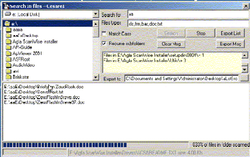

<div align="center">

## New Search in Files


</div>

### Description

This will search inside files for a string.

Useful if you need to save on disk a list of files. It can search in any kind of file, but if you try with compiled ones (exes, dll) or zipped ones, it will most likely not find what you're looking for...
 
### More Info
 


<span>             |<span>
---                |---
**Submitted On**   |2003-12-14 05:03:02
**By**             |[Cesare Imperiali](https://github.com/Planet-Source-Code/PSCIndex/blob/master/ByAuthor/cesare-imperiali.md)
**Level**          |Intermediate
**User Rating**    |5.0 (25 globes from 5 users)
**Compatibility**  |VB 6\.0
**Category**       |[Files/ File Controls/ Input/ Output](https://github.com/Planet-Source-Code/PSCIndex/blob/master/ByCategory/files-file-controls-input-output__1-3.md)
**World**          |[Visual Basic](https://github.com/Planet-Source-Code/PSCIndex/blob/master/ByWorld/visual-basic.md)
**Archive File**   |[New\_Search16836112142003\.zip](https://github.com/Planet-Source-Code/cesare-imperiali-new-search-in-files__1-50403/archive/master.zip)

### API Declarations

```
Rebuilt - Now there is a class that wrap code.
The ScanChunked function is based on a function I saw herearound, which I rated, but had a mistake:
stepped for x=1 to lenOfFile, step 32000
and did not check for remainder or if file was
shorter. This code is also a fix for that one.
Hope you enjoy.
```


